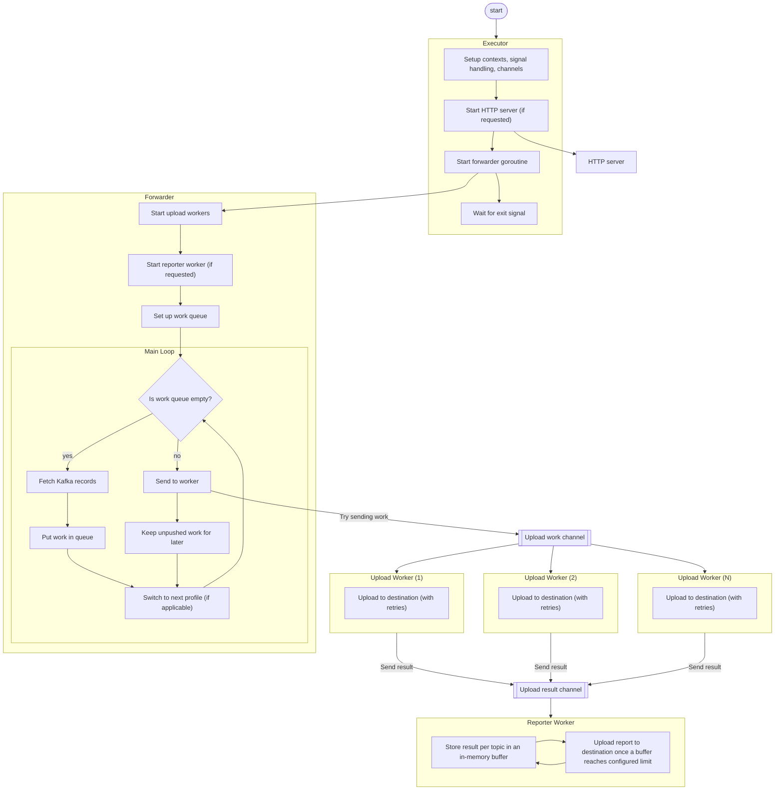
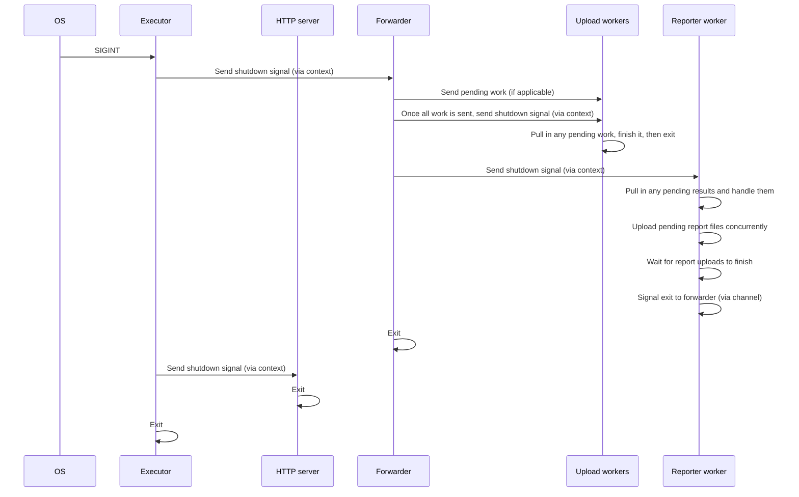

Architecture
===

Forwarder
---

The forwarding mechanism orchestrates Kafka consumption, an (optional) HTTP
server, message file uploads, and (optional) uploads of report files through a
set of cooperating goroutines coordinated by contexts and buffered channels.

### Normal Execution

### Shutdown Mechanism

Note: The executor has a timeout for graceful shutdown. If the running
components do not shut down till that timeout is reached, it exits forcefully.
If a second shutdown signal is sent by the OS, the executor immediately exits as
well.
